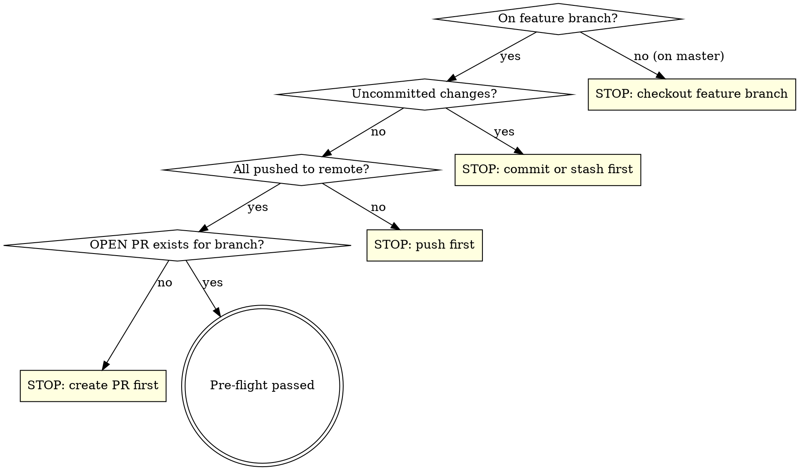

# Deploy Plugin

Prepare and deploy a versioned release of The Another Multi-Brand Global Styles.

## Step 0: Quality Gate

Run the full quality suite **before** anything else. All must pass to proceed.
The order is load-bearing: both e2e targets run `composer build` inside their
zip pipeline and leave `vendor/` in no-dev state, so `make all` (install-dev +
lint + unit test) must come **last** — it restores dev dependencies before the
lint/test gates. The editor bundle needs no separate build step here: the zip
pipeline inside both e2e runs executes `npm run build:editor`, and
`scripts/run-e2e.sh`'s tripwire fails the run loudly if the bundle is missing
from the packaged zip.

```bash
make test-e2e       # functional Playwright suite (Docker)
make check-plugin   # WordPress.org Plugin Check vs the packaged zip (Docker)
make all            # install-dev + lint + unit tests (Docker)
```

If any fail, **stop immediately**. Report the exact error and ask:

> **Quality gate failed.** `<target>` reported errors:
>
> ```
> <error output>
> ```
>
> Should I attempt to fix this?

Wait for the user's answer. If they say yes, attempt the fix, re-run the
failing check, and restart this step from the top. If the fix doesn't work,
stop — do not proceed to pre-flight.

## Pre-flight Checks

After the quality gate passes, verify the branch is clean and ready:



Run these checks:

```bash
# Must not be on master
git branch --show-current  # should NOT be "master"

# No uncommitted changes
git status --porcelain     # should be empty

# All pushed
git log @{u}..HEAD --oneline  # should be empty

# PR exists and is OPEN
gh pr view --json number,title,state -q '.state'   # must be "OPEN"
```

If any check fails, **stop and tell the user** what needs to be done. Do not proceed. If the PR is merged or closed, the branch cannot proceed — this repo's CI (`.github/workflows/e2e.yml`) triggers only on pull_request, so pushing to a branch without an open PR runs no CI and Step 7 would read a stale green run.

## Step 1: Ask Version Type

Read the current version from `package.json`.

If the version type was passed as a skill argument (patch / minor / major),
confirm it briefly:

> Releasing a **<type>** version bump — current version `<version from package.json>`.

If the supplied argument is not exactly patch, minor, or major, do not guess — fall through to asking.

Otherwise, ask the user:

> What type of release? **(patch / minor / major)**
>
> Current version: `<version from package.json>`

If asking, wait for their answer. Do not assume.

## Step 2: Bump Version

```bash
make version-<type>
```

This runs in Docker and updates: `package.json`, `composer.json`, the plugin
header + `THE_ANOTHER_MULTI_BRAND_GLOBAL_STYLES_VERSION` constant in
`the-another-multi-brand-global-styles.php`, `readme.txt` (stable tag + a
`* Version bump` changelog stub), **promotes `CHANGELOG.md`'s `[Unreleased]`
section into a dated release entry**, and syncs both lock files. It commits
nothing — review happens in the next steps and the commit lands in Step 6.

## Step 3: Update Changelogs (two files)

1. Fetch the release's source material:
   ```bash
   gh pr view --json body -q '.body'
   gh pr view --json title -q '.title'
   git log origin/master..HEAD --oneline
   ```

2. `readme.txt`: replace the `* Version bump` stub with a real changelog entry
   in WordPress readme format:
   ```
   = X.Y.Z - YYYY-MM-DD =
   * Fix: ...
   * Add: ...
   * Refactor: ...
   ```
   Each line starts with a category prefix: `Fix:`, `Add:`, `Refactor:`,
   `Docs:`, `Chore:`. Use the PR summary bullets, the commit messages, and the
   just-promoted `CHANGELOG.md` entry as source material.

3. `CHANGELOG.md`: verify the promoted `## [X.Y.Z] - YYYY-MM-DD` entry is
   accurate and non-empty (its content normally accumulated under
   `[Unreleased]` during development). If the promotion produced an empty or
   stale section, write it from the same sources in Keep-a-Changelog style.

## Step 4: Validate Lock Files

```bash
# Check npm lock file is up to date
npm install --package-lock-only
# Check composer lock file is up to date
composer validate --no-check-all
```

If either fails, fix the issue before proceeding.

## Step 5: Re-verify (lint + unit only — deliberately)

```bash
make lint
make test
```

The bump touched version markers and changelog text only, so the e2e suites
are **not** re-run here — Step 0 already gated them against this exact code.
Do not "harden" this step by adding the e2e targets back; that doubles a
15-minute gate for zero coverage. If lint or tests fail, attempt to fix the
issue (one attempt). If the fix doesn't work, stop and tell the user.

## Step 6: Commit and Push

```bash
git add -A
git commit -m "chore: bump version to X.Y.Z, update changelog" -m "Co-Authored-By: Claude Fable 5 <noreply@anthropic.com>"
git push
```

## Step 7: Monitor CI

After pushing, monitor the e2e workflow (`.github/workflows/e2e.yml` — it runs
both suites):

```bash
# Wait a moment for CI to pick up the push, then watch
gh run list --branch <branch> --limit 1 --json databaseId,status,conclusion,headSha
```

Poll the CI run status (use `/loop` or periodic checks). Only treat the run as authoritative once its `headSha` equals `git rev-parse HEAD`; if the latest run is for an older commit, keep waiting — a pre-push run's green is not this release's green. Report outcome:

- **CI passes**: Tell the user the release is ready and the PR can be merged.
- **CI fails**: Fetch the failed job logs, identify the error, attempt one fix,
  commit, push, and re-monitor. If the second attempt also fails, stop and
  show the user the error.

```bash
# Get failed run details
gh run view <run-id> --log-failed
```
